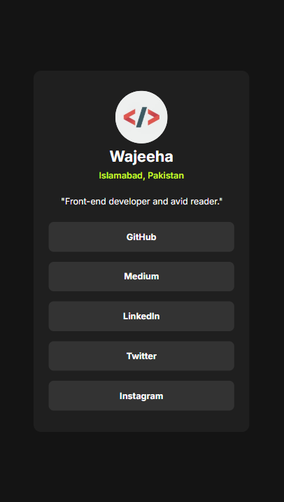
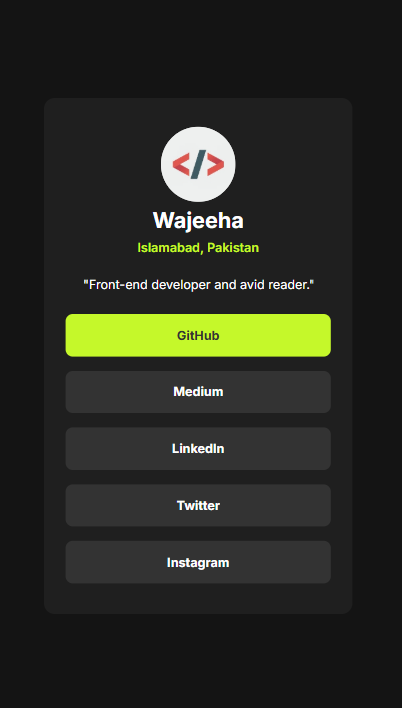
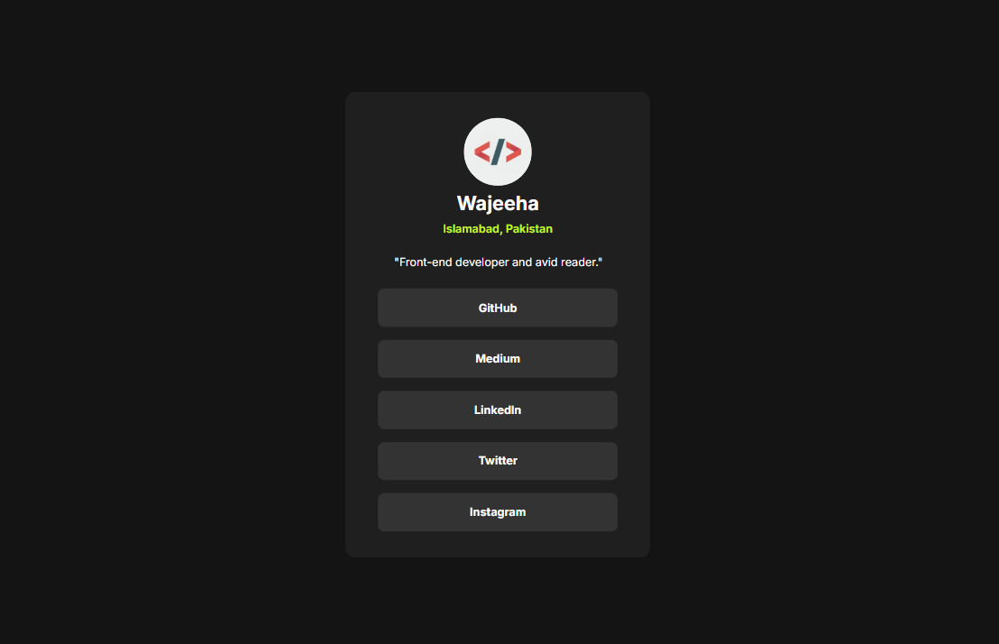

# 🌠Social Profile Card  

A simple and responsive profile card built using **HTML & CSS**.  
It displays a profile picture, name, role, and social links in a clean card layout.  

---

## 📖 Overview  
This project is a beginner-friendly front-end project that shows how to build a profile card design.  
It can be reused for portfolio, business cards, or personal websites.  

---

## ✨ Features  
- 🨠Clean and minimal UI  
- 📱 Fully responsive (works on mobile, tablet, and laptop)  
- 🔗 Social media links included  
- 💻 Easy to customize  

---

## ğŸ–¥ï¸ Technologies Used  
- **HTML5** → for structure  
- **CSS3** → for styling & responsiveness
---

## 📸 Screenshots  
   
 

---

## 🚀 Demo  
🔗 **Live Demo:** 

